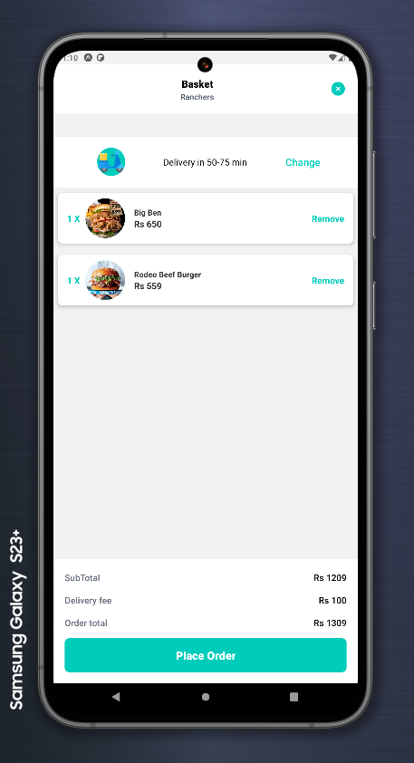
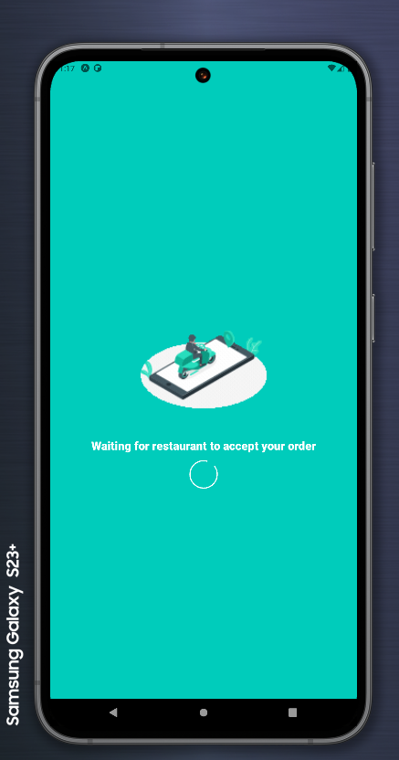

# DELIVEROO CLONE IN REACT NATIVE 

Developed a deliveroo clone using react native, packages like react-native-animateable, Map View using react-native-maps. The project uses SANITY CMS as backend. SANITY powers users with GROQ query language which enables developers to fetch relevant data from projects sanity studio.

KUDOS TO SONNY SANGHA for this tutorial [SONNY SANGHA REACT NATIVE TUTORIAL](https://youtu.be/AkEnidfZnCU?si=WtxdvmomTc0uz9d_)

